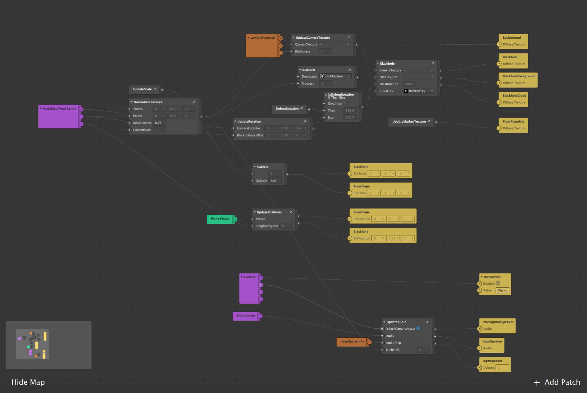
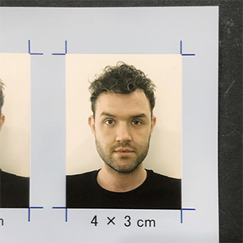

# Singularity AR
World AR Effect for [Facebook Augmented Reality Hackthon](https://fbar1.devpost.com/)  

## Demo
  
Full Video : [https://youtu.be/HTqG8EkMiu0](https://youtu.be/HTqG8EkMiu0)  
Effect URL : [https://www.instagram.com/a/r/?effect_id=533091900949674](https://www.instagram.com/a/r/?effect_id=533091900949674)  
<!-- 
* The glowing disk around the singlarity is called the accetion disk.
* The part below and above the singularity the part of the disk behind the black hole.  
* Because of the immense gravity of the singularity, the light gets bent and shows an image of the disk on top and bottom.  
* The gravitinal lens effect bends the light of the background around the singularity, creating a second image of objects.
* The wavelength of the light gets shortened the closer you get, shifting the color of the accetion disk from red to blue.
* Time also slows down the closer you are to the singularity.  
* The bright area on the left of the accretion disk is due to the relativistic Doppler effect.  
* The part moving towards the viewer is brighter than the part moving away.  
-->

<!-- 
## Patches  

  
_The black hole objects can be imported into a project with a single asp._ 

  
_Low load because 3D objects other than planes are not used._
-->

## Team
   
Adrian Steckeweh [@omega.c](https://www.instagram.com/omega.c/) + Hayato Kuno [@kuno.fell.asleep](https://www.instagram.com/kuno.fell.asleep/)  

## References
[NASA Visualization Shows a Black Hole’s Warped World](https://www.nasa.gov/feature/goddard/2019/nasa-visualization-shows-a-black-hole-s-warped-world) 

## Licence 
_-_
